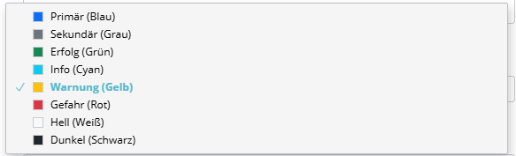
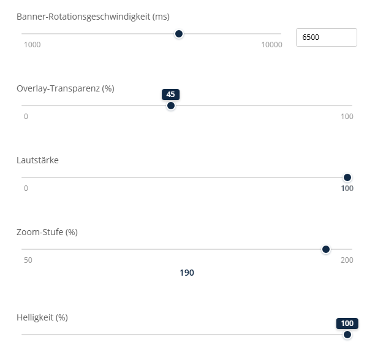

# Sulu Content Types Bundle

Custom Content Types für Sulu CMS 2.6+

[](https://github.com/manuxi/SuluContentTypesBundle/blob/main/LICENSE)
[](https://sulu.io/)
[](https://php.net/)

**Deutsche Version** | [English Version](README.md)

---

## Features

Dieses Bundle bietet drei Custom Content Types für Sulu CMS:

### 1. 🔢 NumberWithDefault
Nummern-Eingabefeld mit Default-Wert-Unterstützung. Erweitert den Standard `number` Typ um einen `default_value` Parameter.

**Anwendungsfälle:**
- Aktualisierungsintervalle
- Timeouts
- Zähler mit Standardwerten


### 2. 🎨 ColorSelect
Auswahlfeld mit Farbvorschau. Beliebige Farb-Paletten per yaml konfigurierbar (s.u.).

**Anwendungsfälle:**
- Button-Farben
- Badge-Farben
- Theme-Farbauswahl


Standard-Optionen (Palette "bootstrap"):



### 3. 🎚️ SliderRange
Visueller Range-Slider mit konfigurierbaren Anzeigemodi. Unterstützt Textbox-Eingabe, schwebende Tooltips und verschiedene Label-Layouts.

**Anwendungsfälle:**
- Banner-Rotationsgeschwindigkeiten
- Deckkraft/Transparenz
- Prioritätsstufen
- Lautstärkeregler



---

## Installation

### 1. Installation via Composer

```bash
composer require manuxi/sulu-content-types-bundle
```

### 2. Bundle aktivieren

Füge das Bundle zu `config/bundles.php` hinzu:

```php
<?php

return [
    // ...
    Manuxi\SuluContentTypesBundle\ManuxiSuluContentTypesBundle::class => ['all' => true],
];
```

### 3. Admin-Assets registrieren

Füge zum Hauptprojekt's `assets/admin/package.json` hinzu:

```json
{
    "dependencies": {
        "sulu-content-types-bundle": "file:../../vendor/manuxi/sulu-content-types-bundle/src/Resources"
    }
}
```

### 4. Import im Hauptprojekt

Füge zum Hauptprojekt's `assets/admin/index.js` hinzu:

```javascript
import 'sulu-content-types-bundle';
```

### 5. Admin-Assets kompilieren

```bash
cd assets/admin
npm install
npm run build
```

### 6. Cache leeren

```bash
bin/console cache:clear
```

---

## Verwendung

### NumberWithDefault

```xml
<property name="refresh_interval" type="number_with_default">
    <meta>
        <title lang="de">Aktualisierungsintervall (ms)</title>
        <title lang="en">Refresh Interval (ms)</title>
    </meta>
    <params>
        <param name="min" value="1000"/>
        <param name="max" value="30000"/>
        <param name="step" value="500"/>
        <param name="default_value" value="5000"/>
    </params>
</property>
```

**In Twig:**
```twig
<div data-refresh="{{ content.refresh_interval }}">
    <!-- Standardwert ist 5000, falls nicht gesetzt -->
</div>
```

### ColorSelect

**Wichtig:** Die Farbe wird im value-Attribut im Format `"key:farbe"` kodiert (z.B. `"primary:#0d6efd"`).

```xml
<property name="button_color" type="color_select">
    <meta>
        <title lang="de">Button-Farbe</title>
        <title lang="en">Button Color</title>
    </meta>
    <params>
        <param name="values" type="collection">
            <param name="primary" value="primary:#0d6efd">
                <meta>
                    <title lang="en">Primary (Blue)</title>
                    <title lang="de">Primärfarbe (Blau)</title>
                </meta>
            </param>
            <param name="secondary" value="secondary:#6c757d">
                <meta>
                    <title lang="en">Secondary (Gray)</title>
                    <title lang="de">Sekundärfarbe (Grau)</title>
                </meta>
            </param>
            <param name="success" value="success:#198754">
                <meta>
                    <title lang="en">Success (Green)</title>
                    <title lang="de">Erfolg (Grün)</title>
                </meta>
            </param>
        </param>
    </params>
</property>
```

**In Twig:**
```twig
<button class="btn btn-{{ content.button_color }}">
    Call to Action
</button>
```

Der zurückgegebene Wert ist nur der Key-Teil (z.B. `"primary"`), nicht der vollständige `"primary:#0d6efd"` String.

### SliderRange

Der SliderRange unterstützt mehrere Anzeigemodi über den `display_mode` Parameter:

```xml
<!-- Klassisch mit Textbox (Standard) -->
<property name="opacity" type="slider_range">
    <meta>
        <title lang="de">Deckkraft</title>
    </meta>
    <params>
        <param name="min" value="0"/>
        <param name="max" value="100"/>
        <param name="step" value="5"/>
        <param name="default_value" value="50"/>
        <param name="display_mode" value="input"/>
        <param name="show_labels" value="true"/>
    </params>
</property>

<!-- Schwebender Tooltip (empfohlen für schmale Spalten) -->
<property name="speed" type="slider_range">
    <meta>
        <title lang="de">Geschwindigkeit</title>
    </meta>
    <params>
        <param name="min" value="1000"/>
        <param name="max" value="10000"/>
        <param name="step" value="500"/>
        <param name="default_value" value="5000"/>
        <param name="display_mode" value="floating"/>
        <param name="show_labels" value="false"/>
    </params>
</property>
```

**In Twig:**
```twig
<div class="banner-slider" data-speed="{{ content.speed }}">
    <!-- Slider mit 5000ms Standard-Rotation -->
</div>
```

---

## Parameter

### NumberWithDefault

| Parameter | Typ | Beschreibung | Beispiel |
|-----------|-----|--------------|----------|
| `min` | number | Minimalwert | `0` |
| `max` | number | Maximalwert | `100` |
| `step` | number | Schrittweite | `1` |
| `multiple_of` | number | Wert muss Vielfaches von sein | `5` |
| `default_value` | number | Standardwert | `10` |

### ColorSelect

| Parameter | Typ | Beschreibung |
|-----------|-----|--------------|
| `values` | collection | Array von Farboptionen |
| `values.*` | value attribute | Key und Farbe im Format `"key:farbe"` |
| `values.*.meta.title` | string | Übersetzbarer Anzeigename (optional) |

**Wert-Format:** `"key:#hexfarbe"` (z.B. `"primary:#0d6efd"`)

**XML-Struktur:**
```xml
<param name="values" type="collection">
    <param name="primary" value="primary:#0d6efd">
        <meta><title lang="de">Primär</title></meta>
    </param>
</param>
```

### ColorSelect Farb-Paletten
***Nutzung von Farb-Paletten mit Service:***
```xml
<param name="values"
        type="expression"
        value="service('sulu_content_types.color_palette_provider').getValues('bootstrap')"
        />
<param name="default_value"
       type="expression"
       value="service('sulu_content_types.color_palette_provider').getDefaultValue('bootstrap')"
/>
```

Eigene Farb-Paletten: config/packages/sulu_content_types.yaml
```yaml
sulu_content_types:
    color_palettes:
        custom:
            primary: '#0d6efd'
            secondary: '#6c757d'
```
Anpassung in der xml: `.getValues('custom')`

Damit sind eigene Farben möglich:


### SliderRange

| Parameter | Typ | Beschreibung | Standard | Beispiel |
|-----------|-----|--------------|----------|----------|
| `min` | number | Minimalwert | `0` | `0` |
| `max` | number | Maximalwert | `100` | `100` |
| `step` | number | Schrittweite | `1` | `5` |
| `default_value` | number | Standardwert | `min` | `50` |
| `display_mode` | string | Anzeigemodus (siehe unten) | `input` | `floating` |
| `show_labels` | boolean | Min/Max Labels anzeigen | `true` | `false` |

#### Anzeigemodi

| Modus | Beschreibung | Am besten für |
|-------|--------------|---------------|
| `input` | Textbox neben Slider mit min/max Labels | Volle Breite, präzise Eingabe erforderlich |
| `floating` | Tooltip über dem Anfasser, sanfte Animation | Schmale Spalten (col-3), cleanes Design |
| `inline` | Aktueller Wert zwischen min/max Labels | Kompakte Layouts |
| `below` | Aktueller Wert zentriert unter Slider | Minimalistische Layouts, Betonung auf Wert |
| `none` | Keine Wertanzeige, nur Slider | Ultra-minimal, nur visuelle Kontrolle |

**Empfohlene Kombinationen:**
- 📱 Schmale Spalten (col-3): `display_mode="floating"` + `show_labels="false"`
- 📊 Volle Breite: `display_mode="input"` + `show_labels="true"`
- 🎨 Minimalistisch: `display_mode="below"` + `show_labels="false"`

---

## Entwicklung

### Projektstruktur

```
SuluContentTypesBundle/
├── src/
│   ├── Content/Type/              # Content Type Klassen
│   ├── DependencyInjection/       # Service-Laden
│   └── Resources/
│       ├── config/services.xml    # Service-Definitionen
│       ├── js/                    # React-Komponenten
│       └── package.json           # JS-Abhängigkeiten
├── docs/                          # Öffentliche Dokumentation
└── docs/dev/                      # Entwickler-Docs (nicht veröffentlicht)
```

### Tests ausführen

```bash
composer test
```

### Code-Style

```bash
composer cs-fix
```

---

## Kompatibilität

- **Sulu CMS:** ^2.6
- **PHP:** ^8.1
- **Symfony:** ^5.4 || ^6.0 || ^7.0
- **React:** ^17.0.0 || ^18.0.0

### JavaScript/Flow Types

Die JavaScript-Komponenten verwenden Flow-Type-Annotationen (`// @flow`). Dies ist optional für die Entwicklung.

Siehe [docs/PHPSTORM_FLOW_FIX.md](docs/PHPSTORM_FLOW_FIX.md) bei IDE-Warnungen.

---

## Zukunftskompatibilität

Dieses Bundle ist mit Blick auf Sulu 3.x-Kompatibilität entwickelt:
- Verwendet SimpleContentType ohne PHPCR-Abhängigkeiten
- Keine direkten PHPCR write/read Methoden
- Zukunftssichere Architektur

---

## Dokumentation

- [Installation Guide](docs/INSTALLATION.md) - Schritt-für-Schritt Installation
- [Beispiel Template](docs/example_template.xml) - Vollständige XML-Beispiele
- [Beispiel Twig](docs/example.html.twig) - Twig-Verwendungsbeispiele

---

## Mitwirken

Beiträge sind willkommen! Bitte fühle dich frei, einen Pull Request einzureichen.

---

## Lizenz

Dieses Bundle steht unter der MIT-Lizenz. Die vollständige Lizenz findest du in:

[LICENSE](LICENSE)

---

## Credits

Erstellt und gepflegt von [Manuxi](https://github.com/manuxi)

---

## Support

- **Issues:** [GitHub Issues](https://github.com/manuxi/SuluContentTypesBundle/issues)
- **Diskussionen:** [Sulu Slack](https://sulu.io/en/community)

---

## Roadmap

Geplante Features für zukünftige Versionen:
- IconSelect (FontAwesome, Material Icons)
- PercentageSlider (mit %-Anzeige)
- CurrencyInput (mit Währungssymbolen)
- ColorPicker (vollständiger Color-Picker)
- DateRangePicker
- TimeRangePicker

---

## Changelog

Siehe [CHANGELOG.md](CHANGELOG.md) für Versionsverlauf.